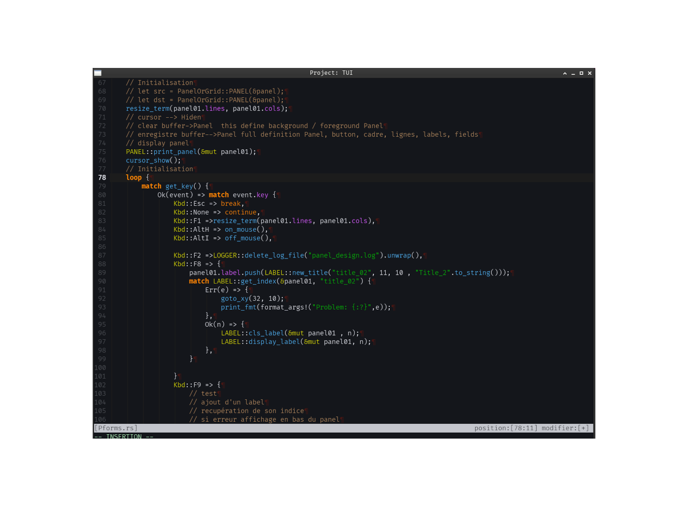
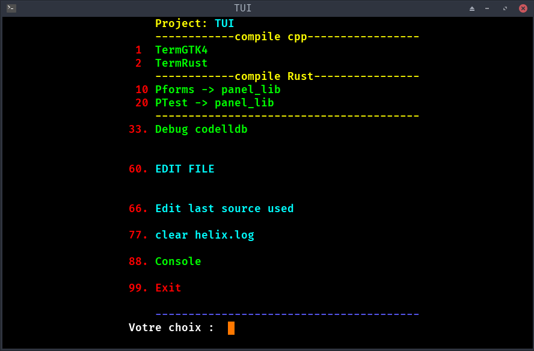

neovim for rust   
  

Version stable     
Because I can't spend all my time configuring an editor... 1 month Because I can't spend all my time configuring an editor... It took me a month to find the right balance and turn it into a real tool.
**THANK YOU to the OPEN-SOURCE community**, 
  
"F12" active source compilation option, to check consistency, involves automatic saving.  
  
UTF-8 character consistency  
  
color  
  
statusline  
a few gems that gave me a few gray hairs  
  
the name of your source is displayed in the window title     
  
"C-l"Purge all buffers except the current “active source” buffer.  
  
"C-e" accesses Neovim's internal explorer directly and closes buffers without saving  
  
I'm leaving you a source  to wrap your Neovim, you can adapt it for terminal applications.(VTE4)  
   
The “LSP” for Rust was configured by Mistral and tested by me, striking a balance between straightness and viability while respecting the route mapped out by Rust.  
  
  
**I deliberately made sure that there were as few plugins as possible (2) and only those necessary for everyday use, and I highlighted the most frequently used functions for programming.
“Keep it as simple as possible.”**
  
  
**2026-02-02** update neovim: NVIM v0.11.6 my clipboard has become obsolete  Neovim uses wl-clipboard.  
**2026-02-03 02:50** update command "Esc": forces normal mode ‘n’ and line color. 
**2026-02-03 10:50** update clipboard   grrrrrrrr  
  
**2026-02-03 11:10** update clipboard  with documentation from neovim and the internet  
  
  
**2026-02-05 09:20** Problems with  "C-q" replace  
change "A-q"  direct output without saving
change "A-r"  search/query
change "A-k"  Retrieve the last buffer 
-- disables replace mode replace mode by default "C-q"
Purge unnecessary functions  
  
  
**Solution for xfce4:  does not work properly with clipman for neovim
install   xclip and parcellite **
  
  
  
  
  
**My configuration made with Mistral IA**

a minimal configuration with 2 plugins optimized for Rust
with a VTE terminal 
  

I installed Neovim and Neovim-LSPConfig with Pacman.

I wanted to have very few dependencies in my configuration, which is why I downloaded two plugins.

[lukas-reineke/indent-blankline.nvim](https://github.com/lukas-reineke/indent-blankline.nvim) 

[terrortylor/nvim-comment](https://github.com/terrortylor/nvim-comment)

  
  

  
  
  
  

  
# TermRust / [RUST_TERM]

**Statut** : validation Terminé (janvier 2026).
**Auteur** : Jean-Pierre Laroche.
**Collaboration** : Développement initial avec l’assistance technique de **Le Chat** (Mistral AI), pour la conversion Zig→Rust et l’optimisation des modules.

---

## 📋 État actuel
- **Fonctionnel** : 90% des modules sont opérationnels (ex: `field.rs`, `term.rs`, gestion des décimaux AFNOR/PostgreSQL).
- **En validation** :
  - Tests finaux sur les performances de `rust-analyzer` (optimisations appliquées).
  - Validation des conversions Zig→Rust pour les modules critiques (ex: `ZIG_TERM`).
- **Documentation** : En cours de finalisation (architecture, exemples d’usage, et notes techniques).

---

## 🛠️ Contributions et remerciements
- **Le Chat (Mistral AI)** :
  - Aide à la **conversion du code Zig vers Rust** (ex: structures `Field`, gestion des attributs `ZoneAttr`).
  - Optimisation des **performances de rust-analyzer** (réduction des latences pour les gros fichiers).
  - Support pour la **gestion des décimaux AFNOR** et l’intégration avec PostgreSQL.
- **Communauté** :
  - Remerciements aux premiers utilisateurs pour leurs retours (signalez les bugs via les *Issues* GitHub).

---

## 📂 Structure du projet
