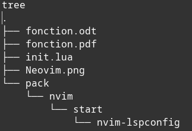
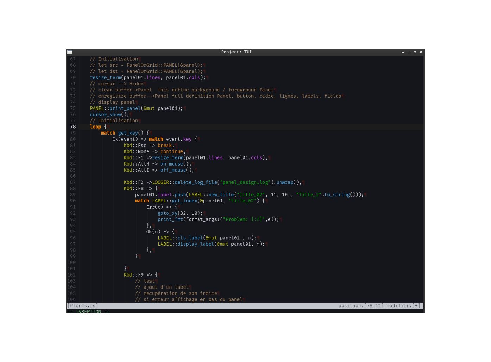
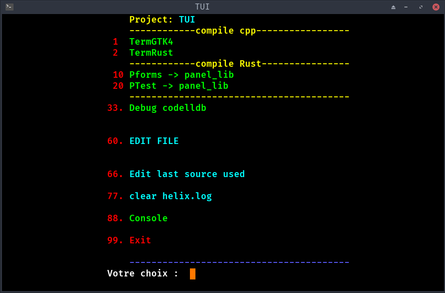

neovim for rust   
  
  
  
Support for the lsp for neovim      
  
  
I did my best to use the basic keyboard keys, e.g., Del, Enter, Ins, etc. Similarly, I tried to stick to the traditional text editor keys, e.g., Ctrl-C, Ctrl-V. 
     
  
  
  

  
  

Version stable     
Because I can't spend all my time configuring an editor... 1 month Because I can't spend all my time configuring an editor... It took me a month to find the right balance and turn it into a real tool.
**THANK YOU to the OPEN-SOURCE community**,   
  
  
cargo_check_errors  Start-up control of the project.  
  
"F2" active source Format the project, involves automatic saving.  
  
"F12" active source compilation option, to check consistency, involves automatic saving.  
  
UTF-8 character consistency  
  
color  
  
statusline  
a few gems that gave me a few gray hairs  
  
the name of your source is displayed in the window title     
  
"C-l"Purge all buffers except the current “active source” buffer.  
  
"C-e" accesses Neovim's internal explorer directly and closes buffers without saving  
  
I'm leaving you a source  to wrap your Neovim, you can adapt it for terminal applications.(VTE4)  
   
The “LSP” for Rust was configured by Mistral and tested by me, striking a balance between straightness and viability while respecting the route mapped out by Rust.  
  
  
**I deliberately made sure that there were as few plugins as possible (2) and only those necessary for everyday use, and I highlighted the most frequently used functions for programming.
“Keep it as simple as possible.”**
  
  
**Solution for xfce4:  does not work properly with clipman for neovim
install   xclip and parcellite **
  

**2026-02-14 22:30**  Remove config and lspconfig  
Support for the new lsp-neovim    
restructuring init.lua, for greater readability   

 
config bashrc 

alias rust-analyzer="$HOME/.cargo/bin/rust-analyzer" 
alias cargo-clippy="cargo clippy --no-deps -- -W clippy::pedantic -A clippy::needless_return" 
alias rustfmt="$HOME/.cargo/bin/rustfmt" 
 

. "$HOME/.cargo/env" 

  
  
  
**My configuration made with Mistral IA**

a minimal configuration with 2 plugins optimized for Rust
with a VTE terminal 
  
 
git clone https://github.com/neovim/nvim-lspconfig ~/.config/nvim/pack/nvim/start/nvim-lspconfig
   
    
lspconfig: is the only current model that works with Rust's workspace; 
  
  
  

pacman -s  jq 

pacman -s  parcelite 

pacman -S  xclip

pacman -S  xsel

I wanted to have very few dependencies in my configuration, which is why I downloaded two plugins.

[lukas-reineke/indent-blankline.nvim](https://github.com/lukas-reineke/indent-blankline.nvim) 

[terrortylor/nvim-comment](https://github.com/terrortylor/nvim-comment)

  
  

  
  
  
  

  
# TermRust / [RUST_TERM]

**Statut** : validation Terminé (fevrier 2026).
**Auteur** : Jean-Pierre Laroche.
**Collaboration** : Développement initial avec l’assistance technique de **Le Chat** (Mistral AI), pour la conversion Zig→Rust et l’optimisation des modules.

---

## 📋 État actuel
- **Fonctionnel** : 90% des modules sont opérationnels (ex: `field.rs`, `termcom.rs`, gestion des décimaux AFNOR/PostgreSQL).
- **En validation** :
  - Tests finaux sur les performances de `rust-analyzer` (optimisations appliquées).
  - Validation des conversions Zig→Rust pour les modules critiques (ex: `ZIG_TERM`).
- **Documentation** : En cours de finalisation (architecture, exemples d’usage, et notes techniques).

---

## 🛠️ Contributions et remerciements
- **Le Chat (Mistral AI)** :
  - Aide à la **conversion du code Zig vers Rust** (ex: structures `Field`, gestion des attributs `ZoneAttr`).
  - Optimisation des **performances de rust-analyzer** (réduction des latences pour les gros fichiers).

---

## 📂 Structure du projet
